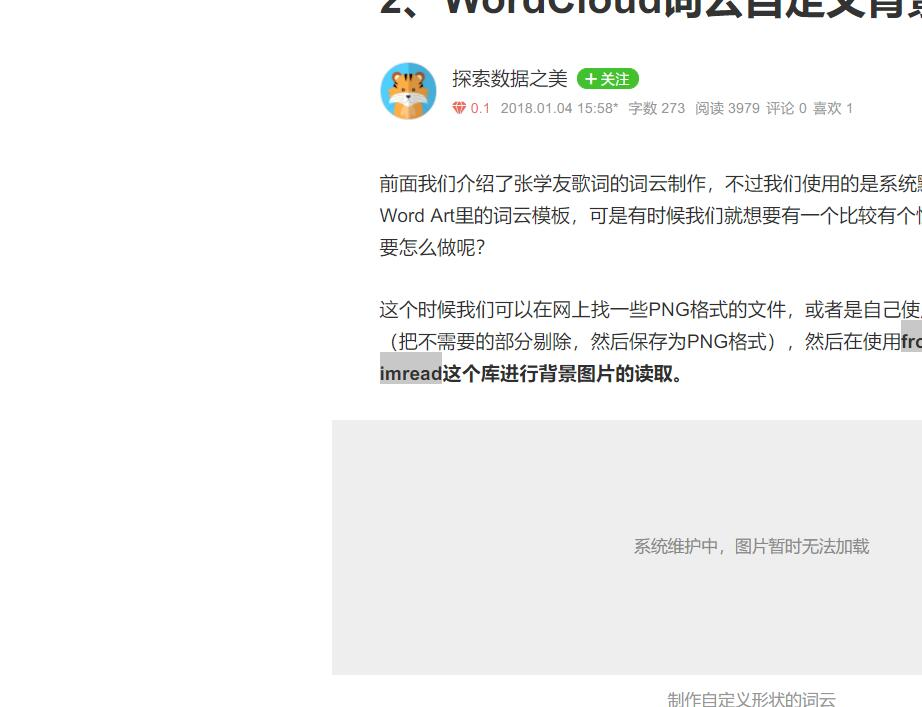

# 2019年6月7日01:11:21

开始使用日志文件记录代码编辑过程

***
-------

# 2019年6月7日01:12:10
得看手机和解决 |   

 `#include《倒计时？`
 
 `jj`
 ~~~
 这是我的代码
 ~~~  
| 项目        | 价格    |  数量   |
| --------    | -----: | :----:  |
| 计算机      | \$1600  |   5    |
| 手机        |   \$12  |   12   |
| 管线        |    \$1  |   234  |
|jaj|d|djkj
|d|d|a

 
